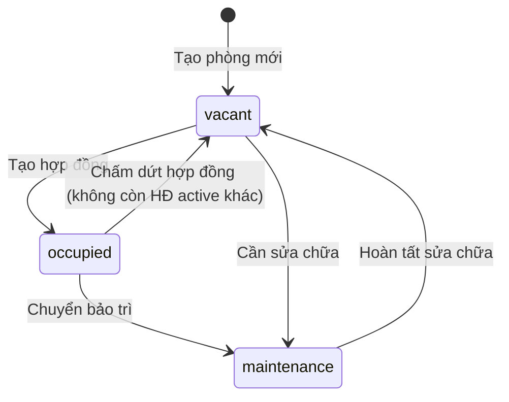
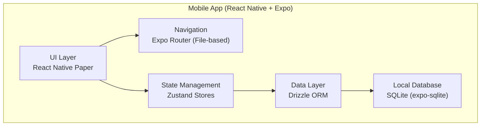
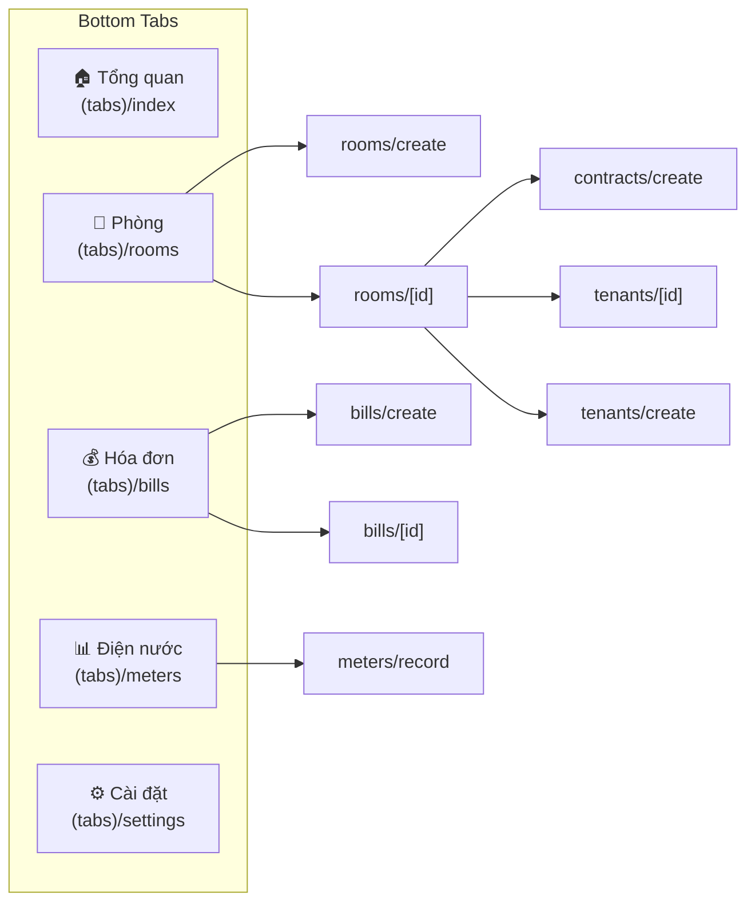
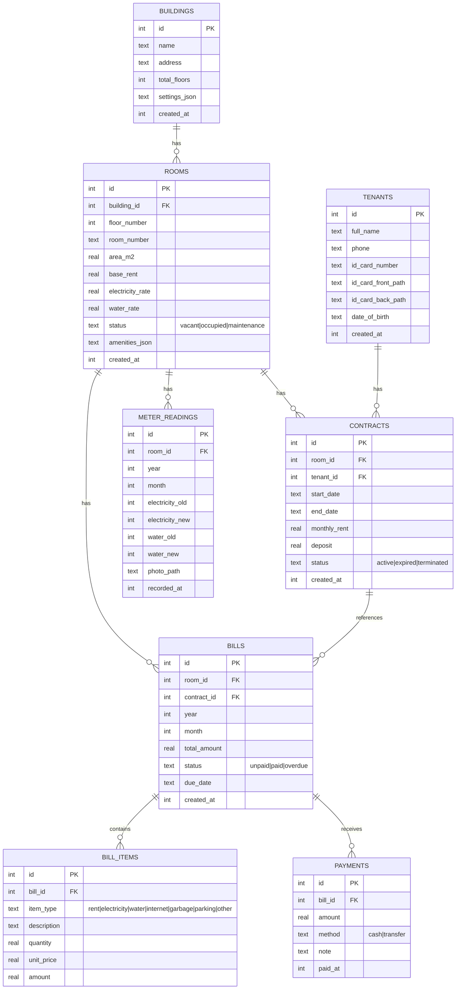

# 📋 QLPhongTro — Tài liệu Tổng quan Dự án

> **Ứng dụng Quản Lý Phòng Trọ / Mini Apartment** — Mobile App cho chủ nhà trọ quản lý toàn bộ vận hành cho thuê phòng.

---

## 1. Mô tả Yêu cầu (Requirements)

### 1.1 Bối cảnh & Vấn đề

Chủ nhà trọ / chung cư mini tại Việt Nam thường quản lý phòng trọ bằng sổ tay hoặc Excel, dẫn đến:
- Khó theo dõi tình trạng phòng (trống / đang thuê / đang sửa)
- Ghi chỉ số điện nước thủ công, dễ sai sót
- Tính tiền hóa đơn hàng tháng mất thời gian
- Không có tổng quan tài chính (đã thu / chưa thu)
- Khó quản lý thông tin khách thuê & hợp đồng

### 1.2 Mục tiêu

Xây dựng một **ứng dụng di động offline-first** giúp chủ nhà trọ:

| # | Mục tiêu | Mô tả |
|---|----------|-------|
| 1 | Quản lý tòa nhà & phòng | Tạo nhiều tòa nhà, quản lý phòng theo tầng, trạng thái, diện tích, giá thuê |
| 2 | Quản lý khách thuê | Lưu thông tin cá nhân, CCCD, SĐT, ngày sinh |
| 3 | Quản lý hợp đồng | Tạo hợp đồng thuê, theo dõi thời hạn, tiền cọc, tự động cập nhật trạng thái phòng |
| 4 | Ghi chỉ số điện/nước | Ghi chỉ số đầu kỳ - cuối kỳ theo tháng, hỗ trợ chụp ảnh đồng hồ |
| 5 | Tạo hóa đơn tự động | Tính toán tiền phòng + điện + nước = tổng hóa đơn |
| 6 | Thanh toán & theo dõi | Ghi nhận thanh toán, tự động đổi trạng thái hóa đơn khi thanh toán đủ |
| 7 | Dashboard tổng quan | Xem nhanh số liệu: tổng phòng, phòng trống, tỷ lệ lấp đầy, doanh thu tháng |

### 1.3 Đối tượng Người dùng

| Vai trò | Mô tả |
|---------|-------|
| **Chủ trọ (Owner)** | Người dùng chính, quản lý toàn bộ hệ thống. Phiên bản hiện tại chỉ hỗ trợ single-user. |

### 1.4 Yêu cầu Phi chức năng

- **Offline-first**: Toàn bộ dữ liệu lưu trên thiết bị (SQLite), không cần internet
- **Cross-platform**: Hỗ trợ Android & iOS
- **Locale**: Giao diện tiếng Việt, tiền tệ VNĐ
- **Performance**: Khởi động nhanh, thao tác mượt trên thiết bị phổ thông

---

## 2. Business Logic (Nghiệp vụ)

### 2.1 Quản lý Phòng



- Phòng thuộc 1 tòa nhà, có số tầng, số phòng, diện tích, giá thuê gốc
- Mỗi phòng có **đơn giá điện** (mặc định 3,500 đ/kWh) và **đơn giá nước** (mặc định 30,000 đ/m³)
- Trạng thái: `vacant` (trống) → `occupied` (đang thuê) → `maintenance` (đang sửa)
- Khi tạo hợp đồng → phòng tự động chuyển thành `occupied`
- Khi chấm dứt hợp đồng cuối cùng → phòng tự động chuyển thành `vacant`

### 2.2 Quản lý Hợp đồng

- Hợp đồng gắn **1 phòng** + **1 khách thuê**
- Thông tin: ngày bắt đầu, ngày kết thúc (có thể vô hạn), giá thuê/tháng, tiền cọc
- Trạng thái: `active` → `expired` → `terminated`
- Giá thuê trong hợp đồng có thể khác giá thuê gốc của phòng (override)
- Khi tạo HĐ: tự động cập nhật `room.status = 'occupied'`
- Khi chấm dứt HĐ: kiểm tra còn HĐ active khác không → nếu không → `room.status = 'vacant'`

### 2.3 Ghi chỉ số Điện/Nước

- Ghi theo **phòng** + **tháng/năm**
- Lưu: chỉ số cũ (old) & chỉ số mới (new) cho cả điện và nước
- Hỗ trợ chụp ảnh đồng hồ (`photoPath`)
- Lượng tiêu thụ = `new - old`

### 2.4 Tạo Hóa đơn (Bill Generation)

> [!IMPORTANT]
> Đây là nghiệp vụ cốt lõi của ứng dụng

```
Hóa đơn tháng = Tiền phòng + Tiền điện + Tiền nước + (Phí khác)
```

**Quy trình tạo hóa đơn cho 1 phòng trong 1 tháng:**

1. Lấy thông tin phòng (đơn giá điện, nước)
2. Lấy hợp đồng active → lấy `monthlyRent` (nếu không có HĐ → dùng `baseRent`)
3. Lấy chỉ số điện/nước của tháng đó
4. Tính chi tiết:

| Mục (Bill Item) | Công thức |
|-----------------|-----------|
| **Tiền phòng** (`rent`) | `contract.monthlyRent ?? room.baseRent` |
| **Tiền điện** (`electricity`) | `(electricityNew - electricityOld) × room.electricityRate` |
| **Tiền nước** (`water`) | `(waterNew - waterOld) × room.waterRate` |
| **Internet** (`internet`) | Phí cố định (nếu có) |
| **Rác** (`garbage`) | Phí cố định (nếu có) |
| **Đỗ xe** (`parking`) | Phí cố định (nếu có) |
| **Khác** (`other`) | Tùy chỉnh |

5. `totalAmount = SUM(tất cả bill items)`
6. `dueDate = ngày 15 của tháng đó`

### 2.5 Thanh toán

- Một hóa đơn có thể được thanh toán **nhiều lần** (partial payment)
- Phương thức: `cash` (tiền mặt) hoặc `transfer` (chuyển khoản)
- Khi `totalPaid >= totalAmount` → hóa đơn tự động chuyển thành `paid`
- Trạng thái hóa đơn: `unpaid` → `paid` / `overdue`

### 2.6 Dashboard

- Tổng phòng, phòng trống, tỷ lệ lấp đầy (%)
- Số tòa nhà
- Tài chính tháng hiện tại: đã thu vs chưa thu (VNĐ)

---

## 3. Kiến trúc Hệ thống (Architecture)

### 3.1 Tổng quan



### 3.2 Kiến trúc Chi tiết

**Pattern: Store-based Architecture (không có backend)**

```
┌──────────────────────────────────────────────────┐
│                    UI Layer                       │
│  app/(tabs)/       → Tab screens (5 tabs)        │
│  app/rooms/        → CRUD phòng                  │
│  app/tenants/      → CRUD khách thuê             │
│  app/contracts/    → Tạo hợp đồng                │
│  app/bills/        → CRUD hóa đơn                │
│  app/meters/       → Ghi điện nước               │
│  src/components/   → Shared UI components        │
├──────────────────────────────────────────────────┤
│                  State Layer                      │
│  src/stores/buildingStore.ts  → Quản lý tòa nhà │
│  src/stores/roomStore.ts      → Quản lý phòng    │
│  src/stores/tenantStore.ts    → Khách + Hợp đồng │
│  src/stores/billStore.ts      → Hóa đơn + TT     │
│  src/stores/meterStore.ts     → Chỉ số điện/nước │
├──────────────────────────────────────────────────┤
│                  Data Layer                       │
│  src/db/schema.ts  → Drizzle schema definitions  │
│  src/db/client.ts  → DB connection + init        │
├──────────────────────────────────────────────────┤
│                Support Layer                      │
│  src/theme/index.ts     → MD3 Theme (Light/Dark) │
│  src/utils/formatters.ts → VNĐ, date, status     │
└──────────────────────────────────────────────────┘
```

### 3.3 Navigation Map



### 3.4 Database Schema (ERD)



---

## 4. Công nghệ Sử dụng (Tech Stack)

### 4.1 Core Stack

| Layer | Công nghệ | Version | Vai trò |
|-------|-----------|---------|---------|
| **Framework** | React Native | 0.83.2 | Cross-platform mobile UI |
| **Platform** | Expo | ~55.0.4 | Build toolchain, native modules |
| **Language** | TypeScript | ~5.9.2 | Type safety |
| **UI** | React | 19.2.0 | UI rendering engine |

### 4.2 Navigation & UI

| Thư viện | Version | Vai trò |
|----------|---------|---------|
| **expo-router** | ^55.0.3 | File-based routing (giống Next.js) |
| **react-native-paper** | ^5.15.0 | Material Design 3 component library |
| **react-native-safe-area-context** | ^5.7.0 | Safe area handling |
| **react-native-screens** | ^4.24.0 | Native screen optimization |
| **react-native-vector-icons** | ^10.3.0 | Icon library |
| **expo-status-bar** | ~55.0.4 | Status bar control |

### 4.3 State & Data

| Thư viện | Version | Vai trò |
|----------|---------|---------|
| **zustand** | ^5.0.11 | Lightweight state management |
| **drizzle-orm** | ^0.45.1 | Type-safe ORM cho SQLite |
| **expo-sqlite** | ^55.0.10 | SQLite native module |
| **drizzle-kit** | ^0.31.9 | Schema migration CLI (dev) |

### 4.4 Form & Validation

| Thư viện | Version | Vai trò |
|----------|---------|---------|
| **react-hook-form** | ^7.71.2 | Form state management |
| **@hookform/resolvers** | ^5.2.2 | Schema resolver integration |
| **zod** | ^4.3.6 | Schema validation |

### 4.5 Utilities

| Thư viện | Version | Vai trò |
|----------|---------|---------|
| **dayjs** | ^1.11.19 | Date manipulation (lightweight) |

### 4.6 Design System

| Token | Giá trị | Ý nghĩa |
|-------|---------|---------|
| **Primary** | `#0EA5E9` | Sky Blue — màu chủ đạo |
| **Secondary** | `#6366F1` | Indigo — màu phụ |
| **Tertiary** | `#F59E0B` | Amber — highlight |
| **Success** | `#10B981` | Emerald — thành công |
| **Danger** | `#EF4444` | Red — lỗi/nguy hiểm |
| **Warning** | `#F97316` | Orange — cảnh báo |
| **Background** | `#F8FAFC` | Nền sáng |
| **Surface** | `#FFFFFF` | Card/component surface |

---

## 5. Cấu trúc Dự án (Project Structure)

```
QLPhongTro/
├── app/                          # 📱 UI Screens (Expo Router)
│   ├── _layout.tsx               #   Root layout (DB init, theme provider)
│   ├── (tabs)/                   #   Bottom tab screens
│   │   ├── _layout.tsx           #     Tab navigator config
│   │   ├── index.tsx             #     🏠 Dashboard / Tổng quan
│   │   ├── rooms.tsx             #     🚪 Danh sách phòng
│   │   ├── bills.tsx             #     💰 Danh sách hóa đơn
│   │   ├── meters.tsx            #     📊 Lịch sử chỉ số điện nước
│   │   └── settings.tsx          #     ⚙️ Cài đặt
│   ├── rooms/
│   │   ├── [id].tsx              #     Chi tiết phòng
│   │   └── create.tsx            #     Thêm phòng mới
│   ├── tenants/
│   │   ├── [id].tsx              #     Chi tiết khách thuê
│   │   └── create.tsx            #     Thêm khách thuê
│   ├── contracts/
│   │   └── create.tsx            #     Tạo hợp đồng (inline tenant)
│   ├── bills/
│   │   ├── [id].tsx              #     Chi tiết hóa đơn + thanh toán
│   │   └── create.tsx            #     Tạo hóa đơn
│   └── meters/
│       └── record.tsx            #     Ghi chỉ số điện nước
│
├── src/                          # 📦 Business Logic & Shared Code
│   ├── db/
│   │   ├── schema.ts             #     Drizzle schema (7 tables)
│   │   └── client.ts             #     DB connection, init, raw SQL
│   ├── stores/
│   │   ├── buildingStore.ts      #     Zustand: CRUD tòa nhà
│   │   ├── roomStore.ts          #     Zustand: CRUD phòng
│   │   ├── tenantStore.ts        #     Zustand: CRUD khách + hợp đồng
│   │   ├── billStore.ts          #     Zustand: hóa đơn + thanh toán
│   │   └── meterStore.ts         #     Zustand: ghi chỉ số
│   ├── components/
│   │   └── common.tsx            #     StatusBadge, SummaryCard, EmptyState
│   ├── theme/
│   │   └── index.ts              #     MD3 Light/Dark theme
│   └── utils/
│       └── formatters.ts         #     formatCurrency, formatDate, labels
│
├── assets/                       # 🖼️ App icons, splash screen
├── app.json                      # Expo configuration
├── package.json                  # Dependencies
└── tsconfig.json                 # TypeScript config
```

---

## 6. Kế hoạch Phát triển (Development Plan)

### Phase 1: MVP — ✅ Đã hoàn thành

| Feature | Trạng thái | Ghi chú |
|---------|-----------|---------|
| Quản lý tòa nhà (CRUD) | ✅ Done | Dialog inline trên tab Phòng |
| Quản lý phòng (CRUD) | ✅ Done | List, filter, search, detail |
| Quản lý khách thuê | ✅ Done | CRUD + inline khi tạo hợp đồng |
| Hợp đồng thuê | ✅ Done | Tạo HĐ, chấm dứt, auto-update room status |
| Ghi chỉ số điện nước | ✅ Done | Ghi theo phòng/tháng, auto-fill old |
| Tạo hóa đơn | ✅ Done | Auto-calculate từ chỉ số + giá phòng |
| Thanh toán | ✅ Done | Partial payment, auto-mark paid |
| Dashboard tổng quan | ✅ Done | Summary cards, tài chính tháng |
| Cài đặt | ✅ Done | Hiển thị thông tin cơ bản |

### Phase 2: Cải thiện UX & Tính năng 🔜

| Feature | Ưu tiên | Mô tả |
|---------|---------|-------|
| Sao lưu / Khôi phục | 🔴 Cao | Export/Import SQLite DB |
| Thông báo nhắc thu tiền | 🔴 Cao | Push notification khi hóa đơn quá hạn |
| Báo cáo doanh thu | 🟡 TB | Biểu đồ doanh thu theo tháng/năm |
| Chụp ảnh đồng hồ | 🟡 TB | Camera integration cho meter readings |
| Export hóa đơn PDF | 🟡 TB | Gửi hóa đơn cho khách thuê |
| Tìm kiếm nâng cao | 🟢 Thấp | Tìm khách thuê, hóa đơn cross-module |
| Dark mode toggle | 🟢 Thấp | Theme đã sẵn sàng, cần toggle UI |
| Quản lý phí dịch vụ | 🟡 TB | Internet, rác, đỗ xe — cấu hình per-room |

### Phase 3: Mở rộng 🔮

| Feature | Mô tả |
|---------|-------|
| Multi-user / Cloud sync | Đồng bộ dữ liệu qua cloud |
| Quản lý nhiều chủ trọ | Role-based access |
| Tích hợp Zalo/SMS | Gửi hóa đơn qua Zalo OA |
| OCR đồng hồ điện/nước | Tự động đọc chỉ số từ ảnh |
| Quản lý tài sản/nội thất | Theo dõi tài sản trong phòng |

---

## 7. Tóm tắt Kỹ thuật Nổi bật

> [!TIP]
> Các quyết định kiến trúc đáng chú ý

| Quyết định | Lý do |
|-----------|-------|
| **Expo + expo-router** | File-based routing giống Next.js, DX tốt, build nhanh |
| **Zustand** thay vì Redux | Lightweight, ít boilerplate, phù hợp app nhỏ-vừa |
| **Drizzle ORM** | Type-safe queries, schema-first, hỗ trợ SQLite mobile tốt |
| **SQLite (offline-first)** | Không cần backend, data on-device, phù hợp single-user |
| **React Native Paper (MD3)** | Material Design 3 components, theme system tốt |
| **react-hook-form + zod** | Form validation type-safe, performant |
| **dayjs** thay vì moment | Bundle size nhỏ (~2KB vs ~70KB) |
| **Store chứa business logic** | Đơn giản, phù hợp offline app không có API layer |

---

> 📅 **Cập nhật lần cuối:** 28/03/2026  
> 📱 **Version hiện tại:** 1.0.0 (MVP)
