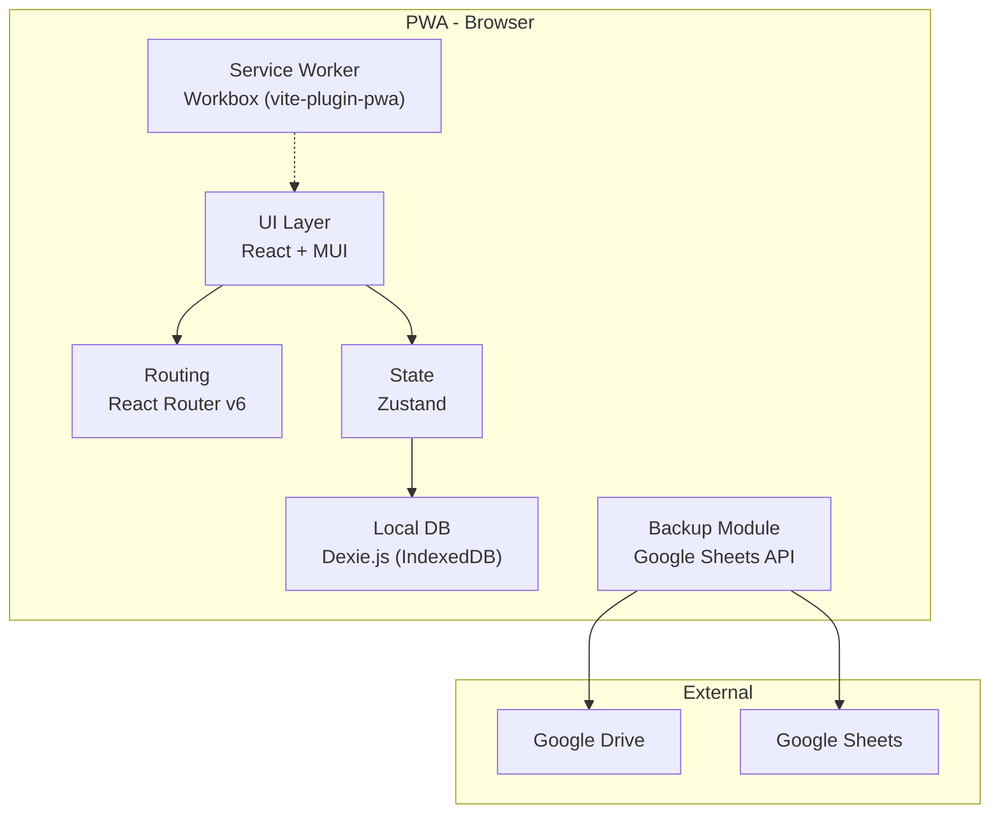

# 🚀 QLPhongTro — PWA Migration Plan

> **Mục tiêu:** Chuyển đổi từ React Native (Expo) sang Progressive Web App (Vite + React + TypeScript)

---

## Tổng quan Kiến trúc Mới



## Tech Stack Mới

| Layer | Công nghệ | Vai trò |
|-------|-----------|---------|
| Build | Vite 6 | Dev server + bundler |
| UI Framework | React 19 + TypeScript | Component-based UI |
| UI Library | MUI v6 (Material UI) | MD3 components |
| Icons | MUI Icons + Emoji | Iconography |
| Routing | React Router v7 | SPA navigation |
| State | Zustand | Lightweight state management |
| Database | Dexie.js (IndexedDB) | Offline-first local storage |
| Forms | React Hook Form + Zod | Form validation |
| Date | dayjs | Date utilities |
| PWA | vite-plugin-pwa (Workbox) | Service worker, manifest |
| Backup | Google Sheets API | Monthly data export |

---

## Phase 1: Foundation (Nền tảng) 🏗️

> **Mục tiêu:** Xóa code cũ, setup project Vite mới, theme, routing, database schema

### Tasks:

- [x] **1.1** Xóa toàn bộ source mobile (`app/`, `src/`, config files) ✅
- [x] **1.2** Khởi tạo Vite + React + TypeScript project ✅
- [x] **1.3** Cài đặt dependencies (MUI, Dexie, React Router, Zustand, etc.) ✅
- [x] **1.4** Cấu hình PWA manifest + Service Worker cơ bản ✅
- [x] **1.5** Setup MUI theme (Light mode, color palette tương tự app cũ) ✅
- [x] **1.6** Setup Dexie.js database schema (8 tables) ✅
- [x] **1.7** Setup React Router với layout (Sidebar/Bottom Navigation) ✅
- [x] **1.8** Tạo layout chính: AppBar + Sidebar + Content area ✅
- [x] **1.9** Tạo trang placeholder cho mỗi module ✅

### Deliverables:
- ✅ App chạy được trên browser (http://localhost:3000)
- ✅ PWA installable (manifest + service worker configured)
- ✅ Navigation hoạt động (6 tabs, responsive sidebar + bottom nav)
- ✅ Database schema sẵn sàng (Dexie.js 8 tables)
- ✅ Shared components: StatusBadge, SummaryCard, EmptyState, PageHeader, ConfirmDialog

---

## Phase 2: Core Modules — Phòng & Tòa nhà 🏠

> **Mục tiêu:** CRUD Tòa nhà + Phòng, Dashboard cơ bản

### Tasks:

- [x] **2.1** Zustand store: `buildingStore` (CRUD tòa nhà) ✅
- [x] **2.2** Zustand store: `roomStore` (CRUD phòng) ✅
- [x] **2.3** UI: Dashboard — summary cards (tổng phòng, phòng trống, tỷ lệ lấp đầy) ✅
- [x] **2.4** UI: Trang danh sách phòng (filter, search, status badge) ✅
- [x] **2.5** UI: Dialog/Form thêm tòa nhà ✅
- [x] **2.6** UI: Form thêm/sửa phòng ✅
- [x] **2.7** UI: Trang chi tiết phòng ✅
- [x] **2.8** Shared components: StatusBadge, SummaryCard, EmptyState, ConfirmDialog ✅

### Deliverables:
- ✅ Quản lý tòa nhà & phòng hoàn chỉnh
- ✅ Dashboard hiển thị số liệu real-time

---

## Phase 3: Khách thuê & Hợp đồng 👤

> **Mục tiêu:** CRUD Khách thuê, Tạo/Chấm dứt Hợp đồng, auto-update room status

### Tasks:

- [x] **3.1** Zustand store: `tenantStore` (CRUD khách + hợp đồng) ✅
- [x] **3.2** UI: Danh sách khách thuê ✅
- [x] **3.3** UI: Form thêm/sửa khách thuê ✅
- [x] **3.4** UI: Chi tiết khách thuê ✅
- [x] **3.5** UI: Form tạo hợp đồng (chọn phòng + khách + dịch vụ + giá) ✅
- [x] **3.6** Logic: Auto-update room status khi tạo/chấm dứt HĐ ✅
- [x] **3.7** UI: Hiển thị hợp đồng trên trang chi tiết phòng ✅

### Deliverables:
- ✅ Quản lý khách thuê hoàn chỉnh
- ✅ Tạo hợp đồng liên kết phòng ↔ khách (với dịch vụ)
- ✅ Trạng thái phòng tự động cập nhật

---

## Phase 4: Điện nước & Hóa đơn ⚡💧

> **Mục tiêu:** Ghi chỉ số, tạo hóa đơn tự động, thanh toán

### Tasks:

- [x] **4.1** Zustand store: `meterStore` (ghi chỉ số) ✅
- [x] **4.2** Zustand store: `billStore` (hóa đơn + thanh toán) ✅
- [x] **4.3** UI: Form ghi chỉ số điện/nước (chọn phòng, tháng, chỉ số cũ/mới) ✅
- [x] **4.4** UI: Lịch sử chỉ số theo phòng ✅
- [x] **4.5** UI: Tạo hóa đơn (auto-calculate từ chỉ số + giá phòng) ✅
- [x] **4.6** UI: Danh sách hóa đơn (filter: tất cả/chưa TT/đã TT/quá hạn) ✅
- [x] **4.7** UI: Chi tiết hóa đơn (bill items breakdown) ✅
- [x] **4.8** UI: Thanh toán (partial payment support) ✅
- [x] **4.9** Dashboard: Thêm section tài chính tháng (đã thu / chưa thu) ✅

### Deliverables:
- ✅ Ghi chỉ số điện nước
- ✅ Tạo hóa đơn tự động
- ✅ Hệ thống thanh toán
- ✅ Dashboard tài chính

---

## Phase 5: PWA Features & Camera 📱

> **Mục tiêu:** Offline mode hoàn chỉnh, Camera API, Install prompt

### Tasks:

- [x] **5.1** Service Worker: cache chiến lược (precache + runtime cache) ✅
- [x] **5.2** Offline fallback page (sử dụng SPA index fallback logic) ✅
- [x] **5.3** Install prompt (A2HS) UI ✅
- [x] **5.4** Camera API: chụp ảnh đồng hồ điện/nước khi ghi chỉ số ✅
- [x] **5.5** Lưu ảnh vào IndexedDB (blob/base64 storage) ✅
- [x] **5.6** Responsive design: tối ưu cho mobile + tablet + desktop ✅
- [x] **5.7** Cài đặt (Settings page): đơn giá mặc định, thông tin app ✅

### Deliverables:
- ✅ PWA hoạt động offline hoàn chỉnh
- ✅ Chụp ảnh đồng hồ
- ✅ Responsive trên mọi device

---

## Phase 6: Backup Google Drive/Sheets ☁️

> **Mục tiêu:** Export dữ liệu theo tháng ra Google Sheets, lưu trên Google Drive

### Tasks:

- [x] **6.1** Export module: serialize IndexedDB → JSON ✅
- [x] **6.2** Export CSV: mở bằng Excel / Google Sheets ✅
- [x] **6.3** UI: Trang Sao lưu & Khôi phục (Backup page) ✅
- [x] **6.4** Import/Restore từ JSON backup ✅
- [x] **6.5** Thống kê dữ liệu (DB stats panel) ✅
- [x] **6.6** Confirm dialog bảo vệ khôi phục ✅
- [ ] **6.7** Google OAuth 2.0 integration (tùy chọn — cần credentials)

### Deliverables:
- ✅ Backup dữ liệu ra JSON (tải về máy)
- ✅ Export CSV để mở bằng Excel / Google Sheets
- ✅ Restore dữ liệu từ backup JSON
- ✅ Thống kê tổng quan dữ liệu

---

## Cấu trúc Dự án Mới (Target)

```
QLPhongTro/
├── public/
│   ├── manifest.json          # PWA manifest
│   ├── icons/                 # PWA icons (192x192, 512x512)
│   └── sw.js                  # Service worker (auto-generated)
├── src/
│   ├── main.tsx               # Entry point
│   ├── App.tsx                # Root component + Router
│   ├── theme/
│   │   └── index.ts           # MUI theme configuration
│   ├── db/
│   │   ├── database.ts        # Dexie.js database class
│   │   └── seed.ts            # (Optional) seed data for dev
│   ├── stores/
│   │   ├── buildingStore.ts
│   │   ├── roomStore.ts
│   │   ├── tenantStore.ts
│   │   ├── billStore.ts
│   │   └── meterStore.ts
│   ├── pages/
│   │   ├── Dashboard.tsx
│   │   ├── Rooms.tsx
│   │   ├── RoomDetail.tsx
│   │   ├── RoomForm.tsx
│   │   ├── Tenants.tsx
│   │   ├── TenantDetail.tsx
│   │   ├── TenantForm.tsx
│   │   ├── Contracts.tsx
│   │   ├── ContractForm.tsx
│   │   ├── Bills.tsx
│   │   ├── BillDetail.tsx
│   │   ├── BillCreate.tsx
│   │   ├── Meters.tsx
│   │   ├── MeterRecord.tsx
│   │   ├── Settings.tsx
│   │   └── Backup.tsx
│   ├── components/
│   │   ├── layout/
│   │   │   ├── AppLayout.tsx   # Main layout (AppBar + Nav + Content)
│   │   │   ├── Sidebar.tsx     # Desktop sidebar
│   │   │   └── BottomNav.tsx   # Mobile bottom navigation
│   │   ├── common/
│   │   │   ├── StatusBadge.tsx
│   │   │   ├── SummaryCard.tsx
│   │   │   ├── EmptyState.tsx
│   │   │   ├── ConfirmDialog.tsx
│   │   │   └── PageHeader.tsx
│   │   └── pwa/
│   │       └── InstallPrompt.tsx
│   └── utils/
│       ├── formatters.ts      # Currency, date, status labels
│       └── constants.ts       # Default rates, enums
├── index.html
├── vite.config.ts
├── tsconfig.json
└── package.json
```

---

## Timeline ước tính

| Phase | Nội dung | Thời gian |
|-------|----------|-----------|
| 1 | Foundation | ~2 ngày |
| 2 | Phòng & Tòa nhà | ~2 ngày |
| 3 | Khách thuê & Hợp đồng | ~2 ngày |
| 4 | Điện nước & Hóa đơn | ~3 ngày |
| 5 | PWA Features & Camera | ~2 ngày |
| 6 | Backup Google Drive | ~3 ngày |
| **Tổng** | | **~14 ngày** |

---

> 📅 **Ngày tạo:** 29/03/2026
> 🔄 **Trạng thái:** ✅ Phase 1 + 2 + 3 + 4 + 5 + 6 hoàn thành — **MVP Ready!** 🚀
